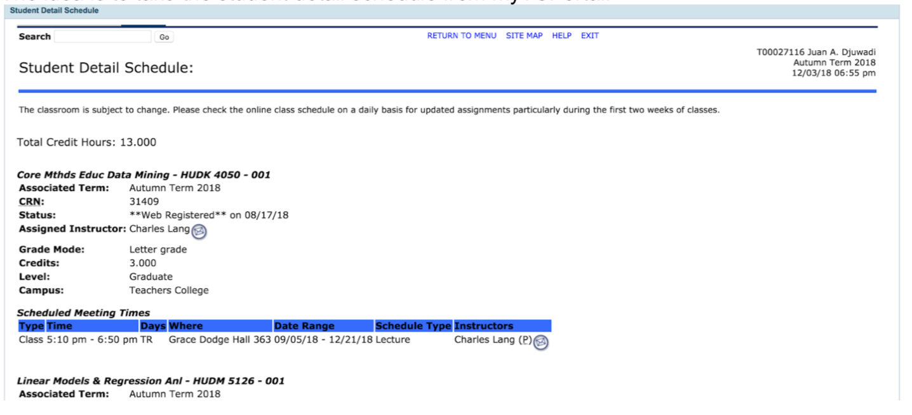
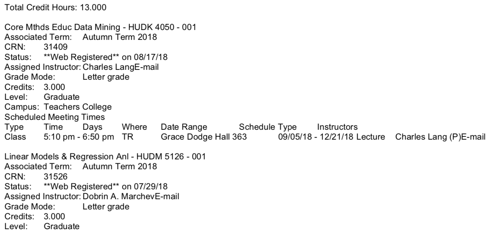
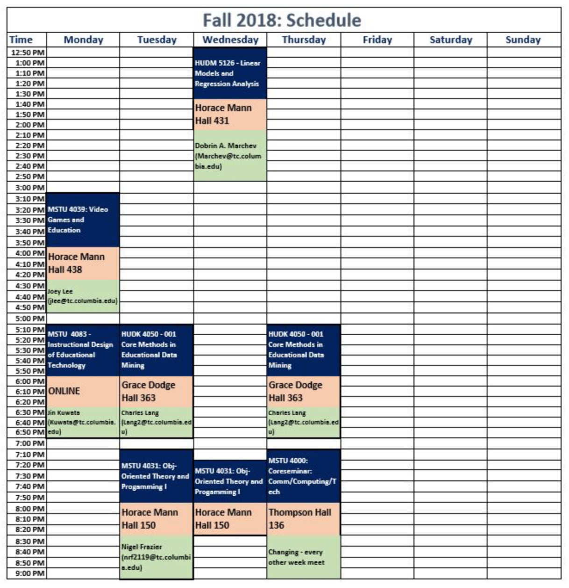

# myTC Scheduler
**Problem**: The current view of the schedule on myTCportal is not user-friendly and difficult to visualize the relationship between your classes and availabilities throughout the week. 

**Project Descritpion**: The idea is to write a program that can create a more graphical view of the schedule for students at TC achieved by simply copying and pasting their schedule from the myTCPortal website to our program. 

From this page, we have the user 'select-all' and copy and paste the information to the text field of our program. The unformatted text that the text field should read looks as so:

The program then parses through the text and visualizes the schedule into one similar to the image below: 

An alternative approach is to create multiple questions which prompts the user for input regarding their class schedule for a single week; however, this is cumbersome for the user and does not automate the process as much as we would like. Having the user simply copy and paste the schedule, while more challenging, gives a far better user experience. The most relevant information a user needs is the class name,class code, class time, class location, and the professor of that class. We aim to provide all this information within every instance of this class (every Java pun in this paragraph is unintended).
A better approach for further improved user experience could be utilizing a web-scraper to collect relevant data based on the user provided link:
https://my.tc.columbia.edu/web/home-community/student-detail-schedule
But this link does not redirect us immediately to the schedule itself as it prompts as to specify a term in a drop-down menu. Additionally, the link when not opened on the same browser or opened through a third-party program will probably require login credentials that the user must provide. This makes for a poorer user experience than all the other options - it also primarily, and unfortunately, beyond the scope of our abilities.

### myTC Scheduler Patch 1.00 2018

*Hello! Thanks for using myTC Scheduler - A Better Way to Visualize your Schedule and Availabilities!*

*This program was built as a final project for MSTU 4031 - Object Oriented Programming 
at Teachers College, Columbia University.*

*The first iteration, while achieving its intended purpose, contains much room for
improvement. Reinserted user input in the text areas layers the visualizations on top of the previous execution. 
Thus, version 1.00 works best re-running the program per each visualization. 
Patch Notes is currently user-editable (try it out yourself). 
TBA and missing class information are handled but is not perfect and fails to work in some instances.*

*Future Updates:
Aside from these bugs, features we plan on adding include dynamic visualization of availabilities for every combination 
of individuals thereby seeing the cross-sectional availabilities within members of the group.* 

*Enjoy!  
Juan (Jay) Djuwadi (jad2296@tc.columbia.edu)  
Peiyu Wang (pw2481@tc.columbia.edu)*
